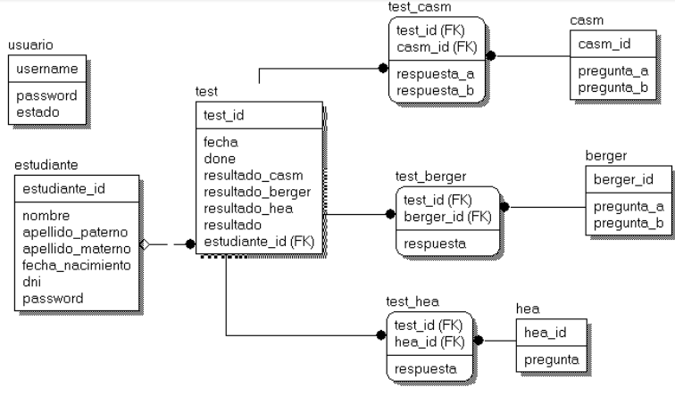

# Experto-Vocacion API

Forntend: https://github.com/User0608/sitioweb-expertos

El desarrollo del proyecto de sistema experto se plantea para la orientación de test vocacional en alumnos de quinto de secundaria. Este proyecto se desarrollará usando Prolog para el análisis de la data, Python para el desarrollo del  microservicio para el sistema experto,y como servicio para el cliente web, se usó Go como lenguaje de backend, React para el frontend, la base de datos PostgreSQL y la aplicación creada es web.
La finalidad será orientar a los alumnos que aún no definen su perfil académico para poder ayudarles en su elección;  la persona usará el sistema experto con el fin de que el sistema pueda brindarle opciones acerca de una posible carrera o vocación a seguir, estas recomendaciones se realizarán después de haber respondido a una serie de preguntas, las cuales verificarán que área es la que el alumno domina, además con las preguntas también se podrá saber el tipo de carácter que posee y el nivel de los hábitos del los alumnos. Esta herramienta permitirá recopilar y analizar cuáles son las posibles carreras compatibles con sus gustos y habilidades del alumno, y brindará un asesoramiento de cuáles son sus posibles opciones a base de sus capacidades.
Para poder saber cuáles son sus preferencias, el sistema mostrará una serie de preguntas y los resultados obtenidos se analizarán por 3 test diferentes, la información de los test usados se muestran a continuación. 

## Objetivo general:
- Mejorar el proceso de orientación vocacional de los estudiantes de 5to de secundaria.

## Objetivos específicos:
- Reducir el tiempo total de entrega de los resultados de la batería de test de orientación vocacional.
- Reducir el tiempo total de análisis de la batería de test de orientación vocacional.
- Obtener un grado de confiabilidad del sistema experto mayor o igual al 90 %.
- Incrementar el nivel de satisfacción de los alumnos y psicólogos de 5to de secundaria.
- Disminuir la frustración de los alumnos por buscar carreras profesionales que vayan con sus preferencias.
- Reducir el tiempo de entrega del diagnóstico clínico de intereses profesionales y ocupacionales aplicando una batería de Test Psicológicos mediante un sistema experto web basado en reglas.
- Realizar entrevistas psicológicas en beneficio de los alumnos de quinto grado de secundaria  aplicando test psicológicos mediante un sistema experto web basado en reglas.

## Base de datos

